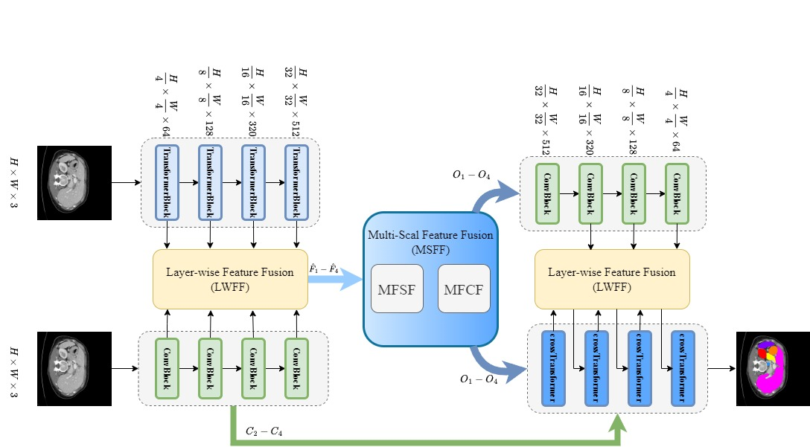
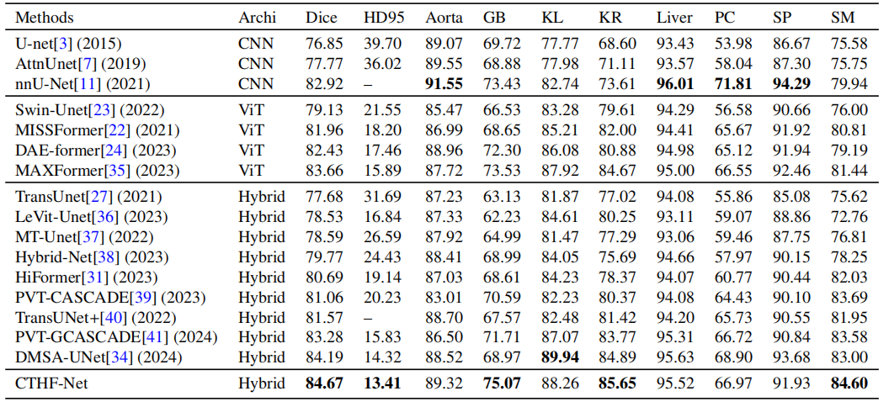
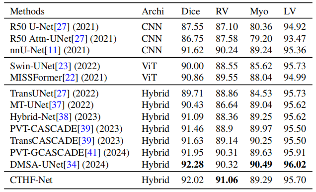

<div align="center">
<h1>CTHF-Net:CNN-Transformer hybrid hierachical feature fusion network for medical image segmentation</h1>

Bing Wang<sup>a,b</sup>,Hao Shi<sup>a</sup>,Zutong Zhao<sup>b</sup>,Shiyin Zhang<sup>c,*</sup>

<div><sup>a</sup>School of Mathematics and Information Science, Hebei University, 071000, Baoding, China</div>
<div><sup>b</sup>Hebei Key Laboratory of Machine Learning and Computational Intelligence, Hebei University, 071000, Baoding, China</div>
<div><sup>c</sup>School of Control and Computer Engineering, North China Electric Power University, 071003, Baoding, China</div>

</div>

## Abstract
Medical image segmentation’s accuracy is crucial for clinical analysis and diagnosis.CNN-Transformer based hybrid approaches show great potential in medical image segmentation due to their complementarity in modeling local and long-range contextual dependencies.However, the features extracted by Convolutional neural network(CNN) and Transformers differ in terms of modality
and property, simplistic or inappropriate fusion strategies are insufficient to fully leverage their complementary strengths, making it difficult for the model to achieve optimal segmentation performance.To address this challenge, we propose CTHF-Net that implements a three-phase fusion mechanism to fully exploit the complementary strengths of these architectures:1) During the encoding
stage, we design a layer-wise feature fusion (LWFF) module efficiently merges local and global feature information from both CNN and Transformer, enabling the network to learn more discriminative multi-scale feature.2) For skip connections, we introduce a multi-scale feature fusion (MSFF) module to capture spatial and channel dependencies among features from different encoding stages while filtering redundant information through multi-scale feature spatial fusion (MFSF) and multi-scale feature channel fusion (MFCF).3) In the decoding stage, a dual-branch decoder leverages the features transmitted through skip connections, while the
LWFF module further integrates the upsampled features at the same stage, allowing the network to more accurately restore image resolution.Comprehensive experiments on four medical datasets demonstrate the superiority, effectiveness, and robustness of our CTHF-Net.

## Overview



## Main Results

- Synapse Multi-Organ Segmentation
  


- ACDC for Automated Cardiac Segmentation
  


## Installation
We recommend the following platforms: 

```
Python 3.10 / Pytorch 11.3 / NVIDIA GeForce RTX 3090 / CUDA 11.6.0 / Ubuntu
```

## Prepare data

#### Dataset:

- **Synapse Multi-Organ Dataset**: Sign up in the [official Synapse website](https://www.synapse.org/#!Synapse:syn3193805/wiki/89480) and download the dataset or download the [preprocessed data](https://drive.google.com/file/d/1tGqMx-E4QZpSg2HQbVq5W3KSTHSG0hjK/view?usp=share_link) and save in the `dataset/synapse/` folder.
- **ACDC Dataset**: Download the preprocessed ACDC dataset from [Google Drive of MT-UNet](https://drive.google.com/file/d/13qYHNIWTIBzwyFgScORL2RFd002vrPF2/view) and move into `dataset/acdc/` folder.

## Training

Using the following command to train & evaluate MSVM-UNet:

```python
# Synapse Multi-Organ Dataset
python train_synapse.py
# ACDC Dataset
python train_acdc.py
```

